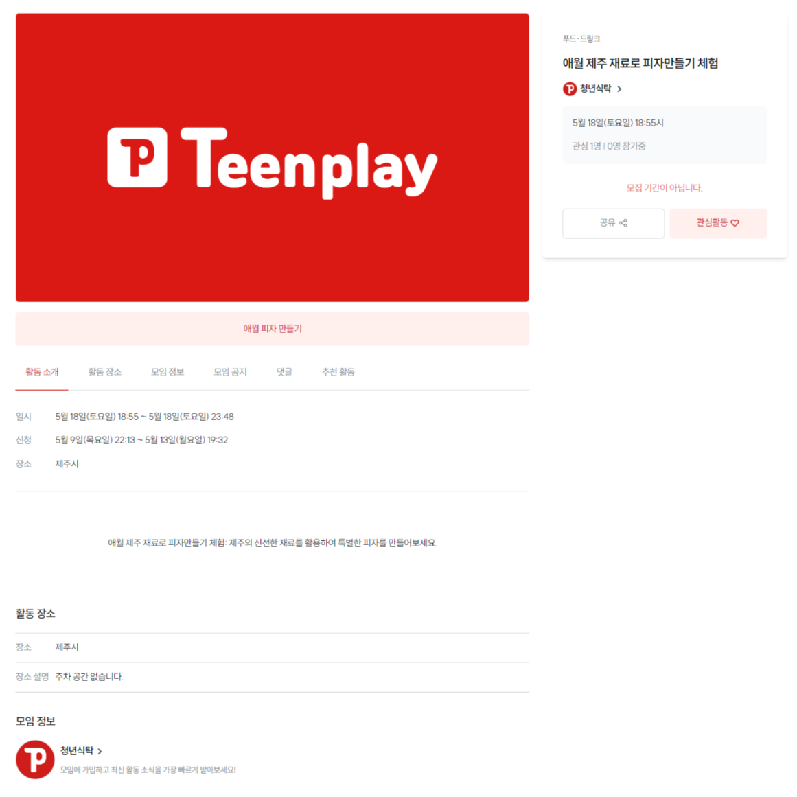
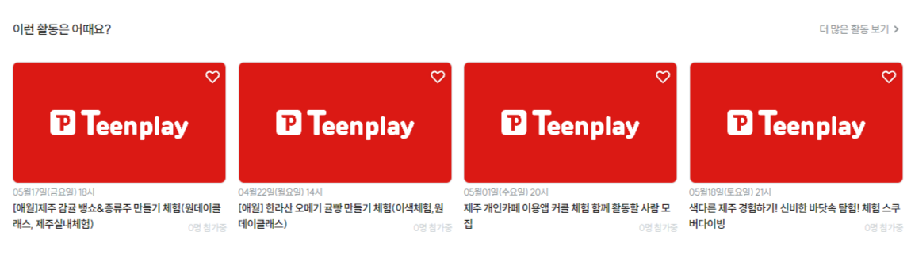

# **틴플레이 활동 추천 서비스**

## **💡목차**

1. 개요
2. 데이터 준비
3. CountVectorizer 사용
4. 코사인 유사도 계산
5. 결과
6. 서비스 기대효과
7. 트러블슈팅
8. 느낀점

## **📋 개요**

활동 페이지 목록에서 게시글을 클릭하면 상세 페이지로 이동합니다.  
상세 페이지 하단에는 현재 보고 있는 활동(게시글)을 제외한 4개의 다른 활동이 표시됩니다.  
`활동 추천 서비스`는 해당 활동 게시글의 제목, 내용, 소개, 장소, 카테고리 데이터를 텍스트로 결합하고,  
`CountVectorizer`를 사용해 이를 벡터화하여 코사인 유사도를 계산하여 유사한 활동을 추천합니다.

### **활동 상세 페이지**

<!--  -->

## **📊 데이터 준비 (Data Collection, Data Preprocessing)**

먼저, 활동 게시글의 데이터를 수집합니다.  
게시글 데이터는 제목, 내용, 소개, 장소, 카테고리 필드로 구성됩니다.
데이터는 `Pandas DataFrame`으로 관리합니다.

    @staticmethod
    def remove_html_tags(text):
        clean = re.compile('<.*?>')
        return re.sub(clean, '', text)

> HTML 태그를 삭제하는 함수입니다.  
> 주어진 텍스트에서 HTML 태그를 정규표현식을 사용하여 찾아내고,  
> 해당 태그를 빈 문자열로 대체하여 삭제합니다.

    @staticmethod
    def remove_special_characters_except_spaces(text):
        """
        주어진 텍스트에서 숫자, 한글, 영어 알파벳을 제외한 모든 특수문자 및 기호를 제거하고,
        공백은 유지합니다.

        :param text: 특수문자 및 기호를 포함한 문자열
        :return: 특수문자 및 기호가 제거된 문자열 (공백 유지)
        """

        clean = re.compile('[^0-9a-zA-Zㄱ-ㅎ가-힣ㅏ-ㅣ ]')
        return re.sub(clean, ' ', text)

> 특수문자 및 기호를 제거하는 함수입니다.  
> 주어진 텍스트에서 숫자, 한글, 영어 알파벳을 제외한 모든 특수문자 및 기호를 찾아내고,  
> 이를 빈 문자열로 대체하여 제거합니다. 이때 공백은 유지됩니다.

  
활동 데이터프레임 생성 코드

        # 활동 테이블에서 필요한 필드를 가져옵니다.
        activities = Activity.enabled_objects.annotate(
                category_name=F('category__category_name')
        ).values(
                'activity_title',
                'activity_content',
                'activity_intro',
                'activity_address_location',
                'id',
                'category_name'
        )

        # activity_data 리스트에 필요한 필드 값을 추가합니다.
        activity_data = []
        for activity in activities:
                activity_data.append(
                (
                        activity['activity_title'],
                        activity['activity_content'],
                        activity['activity_intro'],
                        activity['activity_address_location'],
                        activity['category_name'],
                        activity['id']
                )
                )

        # a_df 에 데이터 프레임을 생성합니다.
        a_df = pd.DataFrame(activity_data, columns=['activity_title', 'activity_content', 'activity_intro', 'activity_address_location', 'category_name', 'id'])

        a_df.activity_content = a_df.activity_content.apply(remove_html_tags)

        a_df.activity_content = a_df.activity_content.apply(lambda x: x.replace("\"", ""))

        a_df['feature'] = a_df['activity_title'] + ' ' + a_df['activity_content'] + ' ' + a_df['activity_intro'] + ' ' + a_df['activity_address_location'] + ' ' + a_df['category_name']

        a_df.feature = a_df.feature.apply(remove_special_characters_except_spaces)

        result_df = a_df.feature

## **📈 CountVectorizer 사용 (Text Vectorization)**

활동 게시글의 텍스트 데이터를 `CountVectorizer`를 사용하여 벡터화합니다.
텍스트 데이터는 제목, 내용, 소개, 장소, 카테고리 필드이며,  
위의 데이터 필드를 하나의 필드로 결합하여 벡터화합니다.

        from sklearn.feature_extraction.text import CountVectorizer

        count_v = CountVectorizer()
        count_metrix = count_v.fit_transform(ActivityDetailWebView.result_df)

<!-- 

  
CountVectorizer

        from sklearn.feature_extraction.text import CountVectorizer

        count_v = CountVectorizer()
        count_metrix = count_v.fit_transform(ActivityDetailWebView.result_df)

 -->

## **📉 코사인 유사도 계산(Cosine Similarity Calculation)**

벡터화된 텍스트 데이터를 사용하여 `코사인 유사도`를 계산하고,  
현재 게시글을 제외한 유사도가 높은 상위 4개의 게시글을 가져옵니다.

        from sklearn.metrics.pairwise import cosine_similarity

        c_s = cosine_similarity(count_metrix)

<!-- 

  
코사인 유사도 계산하기

        from sklearn.metrics.pairwise import cosine_similarity

        c_s = cosine_similarity(count_metrix)

 -->

## **📊 추천(Recommendation) 결과**

코사인 유사도 행렬을 기반으로,  
현재 보고 있는 게시글과 유사도가 높은 상위 4개의 게시글을 나열합니다.  
나열 순서는 왼쪽에서 오른쪽으로 보여집니다.

    @staticmethod
    def get_index_from_title(title):
        return ActivityDetailWebView.a_df[ActivityDetailWebView.a_df.feature == title].index[0]

> 활동 상세 페이지의 텍스트 데이터(title)를 통해 데이터 프레임(a_df)에서 동일한 feature의 인덱스를 찾아주는 함수입니다.  
> 해당 페이지의 텍스트 데이터(title)를 인자로 받아서 해당 데이터를 가진 행의 인덱스(index)를 반환합니다.  
> 즉, 주어진 텍스트 데이터에 해당하는 행의 인덱스를 찾는 역할을 합니다.

    @staticmethod
    def get_title_from_index(index):
        return ActivityDetailWebView.a_df[ActivityDetailWebView.a_df.index == index]['activity_title'].values[0]

> 특정 인덱스(index)에 해당하는 활동 제목(activity_title)을 찾는 함수입니다.
> 이 메서드는 인덱스(index)를 인자로 받아서 해당 인덱스를 가진 행의 활동 제목(activity_title)을 반환합니다.  
> 즉, 주어진 인덱스에 해당하는 행의 활동 제목을 찾는 역할을 합니다.

  
활동 게시글 추천 결과를 반환하는 코드

  
        # 특정 활동의 상세 정보를 가져옵니다.
        detail_title = activity.activity_title
        detail_content = activity.activity_content
        detail_intro = activity.activity_intro
        detail_category = category.category_name
        detail_address = activity.activity_address_location

        # HTML 태그를 제거하고 텍스트 데이터를 결합합니다.
        remove_result = (
        self.remove_html_tags(detail_title) + ' ' +
        self.remove_html_tags(detail_content) + ' ' +
        self.remove_html_tags(detail_intro) + ' ' +
        self.remove_html_tags(detail_address) + ' ' +
        self.remove_html_tags(detail_category)
        )

        # 특수 문자를 제거합니다.
        similar_title = self.remove_special_characters_except_spaces(remove_result)

        # 제목을 기반으로 인덱스를 가져옵니다.
        similar_index = self.get_index_from_title(similar_title)

        # 코사인 유사도를 계산하여 유사한 활동을 정렬합니다.
        similar_activity_result = sorted(list(enumerate(cosine_sim[similar_index])), key=lambda x: x[1], reverse=True)

        all_activities = []  # 모든 활동을 저장할 리스트

        # 유사한 상위 4개의 활동을 리스트에 추가합니다.
        for similar_activity in similar_activity_result[1:5]:
        similar_activity_list = self.get_title_from_index(similar_activity[0])
        activity_items = similar_activity_list.splitlines()
        all_activities.extend(activity_items)

        # 추천 활동 목록에 표시할 활동들을 가져옵니다. 이때 현재 보고 있는 활동은 제외합니다.
        recommended_activities = list(
        Activity.enabled_objects.filter(activity_title__in=all_activities).exclude(id=activity_id)[:4]
        )

        # 관련이 높은 순서대로 다시 정렬합니다.
        recommended_activities = sorted(recommended_activities, key=lambda x: all_activities.index(x.activity_title))

## **📌서비스 기대효과**

1. **탐색 피로도 감소효과**  
   활동 페이지는 최신순, 활동 종료순으로 나열됩니다.  
   특정 텍스트를 검색하지 않아도 현재 페이지에서 사용자가 관심있어하는 게시글을 나열하여 사용자의 인사이트에 맞는 활동을 보여줄 수 있습니다.

2. **롱테일 효과**  
   덜 인기있는 콘텐츠도 유사도 분석을 통해 더 많은 노출 기회를 얻게 됩니다.  
   이는 콘텐츠 플랫폼의 전체적인 활성화에 기여할 수 있습니다.

3. **사용자 유지율 향상**  
   사용자가 더 많은 활동에 관심을 가지게하여 다양한 활동을 할 수 있도록 유도할 수 있습니다.

4. **틴플레이 기대효과 불러오기**  
   틴플레이의 기획 목적은 청년들이 공동체 의식을 가지고 주체적인 단체활동을 하는 것입니다.
   다양한 활동을 하게된다면 그 활동을 하는 모임에 참여할 가능성이 높아지고,  
   모임에 참여하게 된다면 또 다른 활동에 참여할 기회를 만들어주는 선순환의 역할을 합니다.

5. **사이트의 매출 증대**  
   활동 개설은 사이트의 매출과 연관되어 있습니다.  
   활동 참여가 많아지고 더 많은 활동이 생긴다면 곧 사이트의 매출 증대로 이어집니다.

## **📌트러블 슈팅**

**문제 발생** : 특정 게시글을 선택했을때, 관련 활동이 아닌 의미없는 단어가 유사한 게시글이 나열됐다.

**원인 추론** : 전체 텍스트를 전부 벡터화 하여 유사도를 검색하기 때문에 단순하고 의미없이 반복되는 단어로 인해 유사도 분석시 정확도가 떨어지는 결과를 반환했습니다.

**해결 방안** : `원데이`, `나만의` 와 같은 단어들이 많이 반복되고 정확도를 저해합니다.
텍스트에서 제거하고자 하는 단어들을 지정하고, 이를 빈 문자열로 대체하는 코드를 작성하였습니다.

                remove_result = remove_result.replace("나만의", " ").replace("원데이", " ")

**결과 확인** : 정확도가 더 높은 적절한 활동을 추천할 수 있게 되었습니다.

## **📌느낀점**

-   데이터 분석과 러닝머신을 배우고 이를 활용한 AI 서비스를 개발하면서 배운 것들이 실제 사이트에서 어떤 경우에 어떻게 활용되는지 체감해볼 수 있는 좋은 기회가 되었습니다.

-   특히 카운터벡터머신과 코사인유사도를 통한 텍스트 분석 방법을 실제로 구현해보면서 이 방법이 주는 장점과 보완할 점을 찾아볼 수 있었습니다.
-   먼저 코사인유사도를 사용한 텍스트 분석은 게시글간의 유사도를 직관적으로 파악하고 텍스트화된 데이터를 사용할 때 유용한 분석 방법이라는 것을 느낄 수 있었습니다.
-   그러나 반대로 텍스트의 문맥이나 의미를 충분히 반영하지 못하는 경우에는 올바르지 못한 분석 방법이 될 수도 있다는 것도 배울 수 있었습니다.  
    특히 단순한 단어 빈도 기반의 벡터화는 동의어나 문맥의 차이를 반영하지 못해 정확도가 떨어진다는 것도 확인할 수 있었습니다.
-   이러한 단점을 보완하기 위해 필요하지 않은 문자를 제거하는 전처리 과정을 거쳐 유사도 분석 서비스의 정확성을 높이고자 하였습니다.
-   다음 프로젝트에서 코사인 유사도를 사용해 분석하는 서비스를 구축한다면 가중치를 적용할 수 있는 라이브러리를 사용하여 단어의 중요도를 반영하여 좀 더 정확하고 구체적인 분석 서비스를 만들어보고자 합니다.  
    이는 시스템의 정밀도를 높이고 사용자의 만족도를 더욱 향상시킬 수 있을 것으로 기대됩니다.
